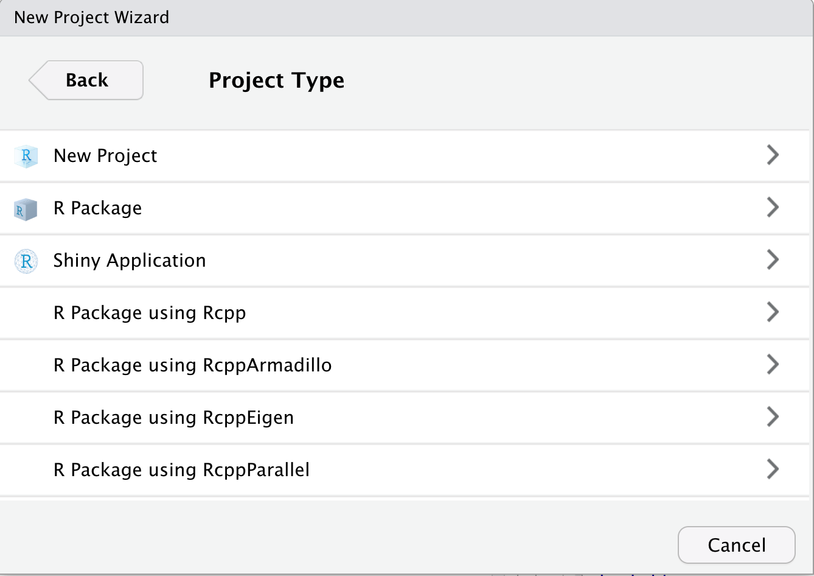

```{r setup, include=FALSE}
knitr::opts_chunk$set(warning = F, message = F)
library(dplyr); library(ggplot2); library(ggpubr);library(Pabloverse)
```

# The Rstudio interface

When we start R studio, we can see 4 sections:

  1. **Source** (top left), here we have our code editor and other files. We will use this section to edit and view our scripts and other documents we will be using to interact with R.
  2. **Console and Terminal** (bottom left), this is where the code is executed (*Console* will execute R code and *Terminal* other code for your operating system). We can directly write the code here, but normally we will be using the other source files such as .R or .Rmd to write our code which then will be send here.  
  3. **Environment, History and others** (top right), Environment will list all the objects you create and History will have the code you sent to the console. There are other tabs in this section which we wont be using for now.
  4. **Files, Packages and Help** (bottom right). This section includes a file browser, and other tabs for package management and help.
  


# Organizing your projects

One of the most useful features of R studio is the project organization, if you haven, I strongly encourage you to familiarize with creating and using projects to organize your workflow. Projects allow to create a file that will contain all the information regarding your session (including objects, data sets and configurations) and organize your files in folders in your system. This is particularly useful when we are working with multiple topics.  
When you open Rstudio for the first time it starts on an empty project. To create a new project, just go to the top right corner menu and select *New Project...*


Then will five you the option to create a new project in a new directory, un an existing directory or version control. For today, we wont be talking about version control in detail, but this is to integrate Rstudio with Github.


  
Once you have selected the option that you want, it will show you multiple options for types of projects, you can select *New project* and continue.  



Then you just name your directory and select a location.  


Once the project is created, in the files tab you will see that Rstudio created the files for your project in the folder that you selected. The project organization depends on your personal preferences, but I usuallly like to create 3 folders (code, data and docs) to organice my files related with the current project.


# Intro to Markdown

## Documents with Rmd

## Presentations with quatro
